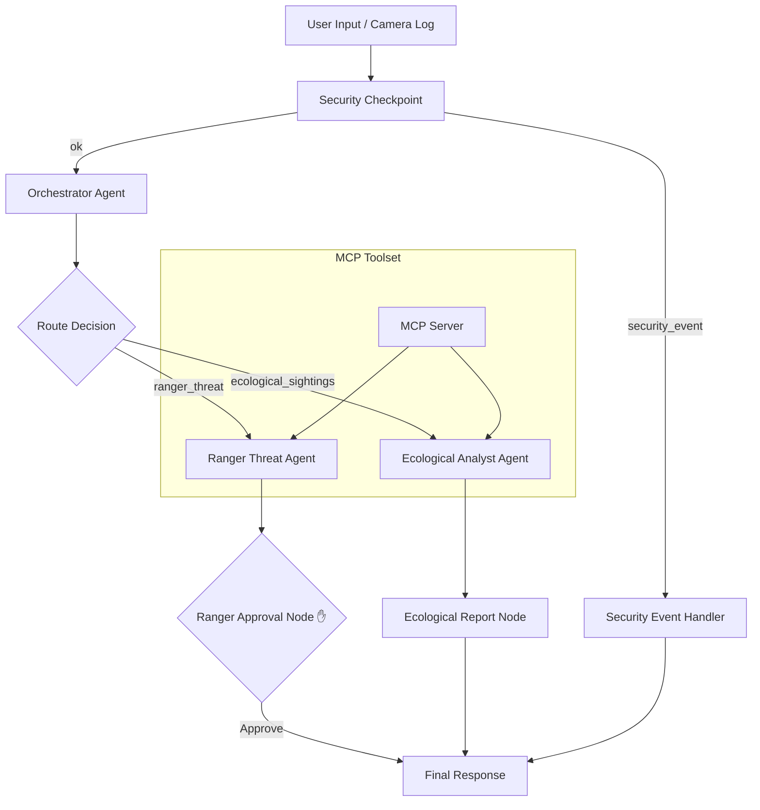
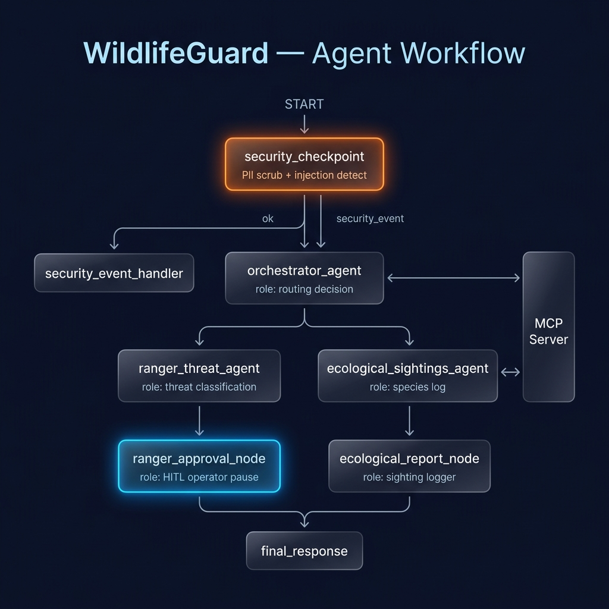
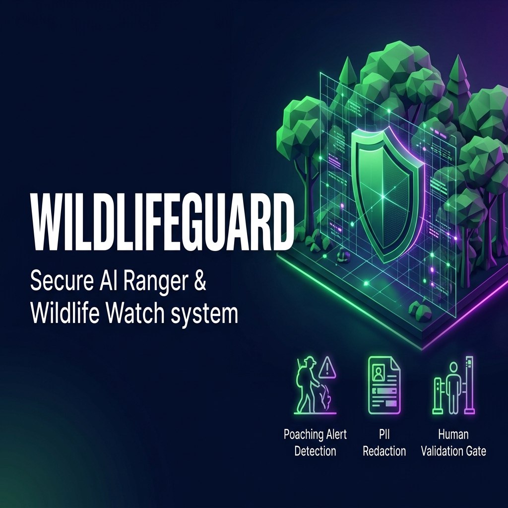

# WildlifeGuard — Secure AI Ranger & Wildlife Watch system

WildlifeGuard is a multi-agent AI system built on the Google Agent Development Kit (ADK) that processes surveillance logs and citizen reports to secure conservation parks against poaching and compile ecological insights.

## Prerequisites

- **Python 3.11 or higher**
- **uv** — Fast Python package manager
- **Gemini API Key** from [Google AI Studio](https://aistudio.google.com/apikey)

## Quick Start

1. **Clone & Navigate**
   ```bash
   git clone <your-repo-url>
   cd wildlife-guard
   ```

2. **Configure Credentials**
   Create a `.env` file in the root of the project:
   ```env
   GOOGLE_API_KEY=your_gemini_api_key
   GOOGLE_GENAI_USE_VERTEXAI=False
   GEMINI_MODEL=gemini-2.5-flash
   ```

3. **Install Dependencies**
   ```bash
   make install
   ```

4. **Start the Playground UI**
   - **On Windows**:
     ```powershell
     uv run adk web app --host 127.0.0.1 --port 18081 --reload_agents
     ```
   - **On macOS / Linux**:
     ```bash
     make playground
     ```
   The UI will open at [http://localhost:18081](http://localhost:18081).

---

## Architecture Diagram



---

## How to Run

- **Interactive Playground (Dev UI):**
  ```bash
  make playground
  ```
  Runs the local dev server on port 18081 with hot-reloading.
  
- **Production API Server:**
  ```bash
  make run
  ```
  Runs a FastAPI backend on port 8080.

---

## Sample Test Cases

### Test Case 1: Poaching Threat Alert (Urgent Dispatch with HITL)
- **Input (JSON or chat):**
  ```
  Alert: Surveillance camera at Lat 4.56, Long -74.12 spotted 3 intruders with rifles entering Sector 4 at 02:00 AM.
  ```
- **Expected routing:** `security_checkpoint` -> `orchestrator_agent` -> `ranger_threat_agent` -> `ranger_approval_node` (Pauses for human confirmation).
- **Check in UI:** The playground will display a prompt asking: *"✋ PAUSE FOR OPERATOR APPROVAL: Do you approve sending this ranger dispatch alert? (yes/no)"*. Reply `yes` or `no` to resume.

### Test Case 2: Wildlife Migration Observation (Eco report using MCP Database)
- **Input (JSON or chat):**
  ```
  Observation: Spotted a herd of 50 elephants near coordinates Lat 1.25, Long -60.05 moving north.
  ```
- **Expected routing:** `security_checkpoint` -> `orchestrator_agent` -> `ecological_sightings_agent` -> `ecological_report_node` (Invokes the MCP Database lookup tool to check elephant status and logs report).
- **Check in UI:** Outputs a formatted ecological report indicating elephant status as *"African Forest Elephant (Critically Endangered)"*.

### Test Case 3: PII Masking & Security Block
- **Input (JSON or chat):**
  ```
  Visitor report from tourist Alice (alice@gmail.com, phone: 555-0199): Spied a beautiful rhino near Sector 3. Licence plate ABC-1234 was parked nearby.
  ```
- **Expected routing:** `security_checkpoint` (scrubs email, phone, and plate) -> `orchestrator_agent` -> `ecological_sightings_agent`.
- **Check in log:** Check terminal log where `security_checkpoint` ran. A structured JSON audit entry will be logged showing `"pii_redacted": true`, and output text contains `[REDACTED_PLATE]`.

---

## Troubleshooting

1. **Error: `404 Live model not found` on queries**
   - **Fix:** Verify your `.env` contains `GEMINI_MODEL=gemini-2.5-flash`. Older model families like `gemini-1.5-*` are retired and return 404s.
2. **Changes to agent code are not reflected (Windows)**
   - **Fix:** On Windows, hot-reload is disabled. Stop the server and start it again:
     ```powershell
     Get-Process -Id (Get-NetTCPConnection -LocalPort 18081, 8090 -ErrorAction SilentlyContinue).OwningProcess | Stop-Process -Force
     make playground
     ```
3. **Error: `No module named mcp`**
   - **Fix:** Run `uv sync` to ensure local virtual environment dependencies are fully aligned.

---

## Push to GitHub

1. Create a new repo at https://github.com/new
   - Name: wildlife-guard
   - Visibility: Public or Private
   - Do NOT initialize with README (you already have one)

2. In your terminal, navigate into your project folder:
   cd wildlife-guard
   git init
   git add .
   git commit -m "Initial commit: wildlife-guard ADK agent"
   git branch -M main
   git remote add origin https://github.com/ananya2126/wildlife-guard.git
   git push -u origin main

3. Verify .gitignore includes:
   .env          ← your API key — must NEVER be pushed
   .venv/
   __pycache__/
   *.pyc
   .adk/

⚠ NEVER push .env to GitHub. Your API key will be exposed publicly.

## Assets




## Demo Script
Refer to [DEMO_SCRIPT.txt](file:///d:/adk-worksspace/wildlife-guard/DEMO_SCRIPT.txt) for presentation narration.
