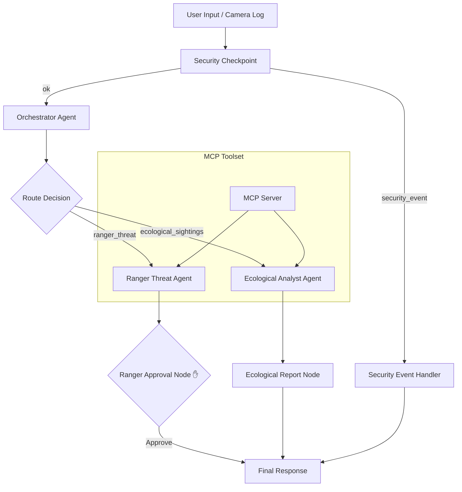

# Submission Write-Up — WildlifeGuard

## Problem Statement
Wildlife reserves globally struggle with limited resource capabilities to monitor vast wilderness areas. Traditional trail cameras collect a massive amount of data, but rangers cannot monitor them in real-time or process species counts manually without severe delay. Meanwhile, reporting channels are vulnerable to exposing tourist/citizen privacy (PII) or processing unauthorized commands (prompt injections). There is a critical need for an automated, secure, and smart dispatcher that classifies alerts, retrieves species data, filters sensitive details, and requests human confirmation before deploying patrols.

---

## Solution Architecture

---

## Concepts Used

- **ADK Workflow (Graph-based API 2.0):** Defined in `app/agent.py` using `Workflow(edges=[...])` routing.
- **LlmAgent:** Employed three LlmAgents (`orchestrator_agent`, `ranger_threat_agent`, and `ecological_sightings_agent`) for planning, reasoning, and tool executions.
- **MCP Server:** Runs locally as `app/mcp_server.py` using stdio transport, exposing 3 specialized tools to agents.
- **Security Checkpoint:** The `security_checkpoint` function node in `app/agent.py` scrubs PII and checks for prompt injection.
- **Human-in-the-Loop (HITL) Flow:** Uses `RequestInput` inside the `ranger_approval_node` to pause execution for a ranger confirmation.
- **Agents CLI:** Scaffolding and setup using the `agents-cli` framework templates.

---

## Security Design

1. **PII Scrubbing:** Trail camera logs or citizen reports often contain names, phone numbers, emails, or vehicle license plates. A regex-based scrubbing layer replaces these with mask tags (e.g. `[REDACTED_PLATE]`) in `security_checkpoint` before sending data to the LLM or saving alerts.
2. **Prompt Injection Guard:** Restricts threat agents from executing malicious instructions embedded in visitor logs by detecting keywords (e.g., "ignore previous instructions") and routing to a dedicated safety fallback (`security_event_handler`).
3. **Audit Trail:** Outputs structured JSON records of every security checkpoint decision to a secure Stream log, tagging records with severity levels (`INFO`, `WARNING`, `CRITICAL`).

---

## MCP Server Design

Exposes 3 specialized tools to agents:
- `get_wildlife_db(species_name)`: Looks up conservation categories (e.g., "Critically Endangered") and sector sanctuary limits.
- `report_ranger_alert(alert_message, location, severity)`: Dispatches ranger teams with priority statuses.
- `get_weather_location(latitude, longitude)`: Queries coordinate metadata including camera battery status, weather, and light levels (day/night) to optimize dispatch operations.

---

## HITL Flow
To prevent accidental, incorrect, or expensive ranger team dispatches, a **Human-in-the-Loop** pause is integrated via `RequestInput` in `ranger_approval_node`. If a threat is classified as a security threat, the agent halts execution and requests a boolean operator check ("yes/no"). The alert is officially dispatched only upon receiving "yes".

---

## Demo Walkthrough

1. **Test Case 1 (Ranger Dispatch):** Demonstrates the system detecting "intruders with rifles in Sector 4" and asking the operator for authorization to deploy teams.
2. **Test Case 2 (Ecology Sighting):** Shows species tracking. The system detects "50 elephants near coordinates" and automatically pulls "African Forest Elephant (Critically Endangered)" from the MCP database to populate the report.
3. **Test Case 3 (Security Scrubbing):** Proves privacy compliance by redacting a tourist's email and licence plate details during a rhino sighting report.

---

## Impact / Value Statement
WildlifeGuard connects real-time camera telemetry with field operations safely. By automating species classification and filtering sensitive PII, it reduces administrative work for environmental analysts. The human validation gate ensures that ranger squads are only dispatched when necessary, optimizing critical park conservation resources.
